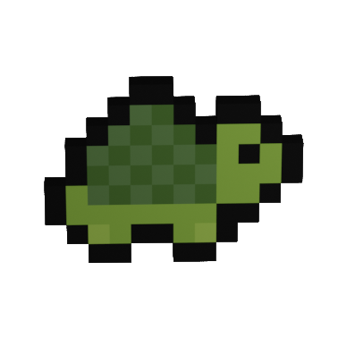

* You're a robot in a warehouse - collect batteries, stay alive!
* A game exploring the basics of 3D movement, using retro graphics generated in DALLE2!

Batteries Not Included is a short retro-style arcade game developed with LÖVE. Race around a warehouse floor, collecting battery charge to stay alive! Maneuver and use helpful power-ups to help locate each new battery, and reach a new high score!

### How to play
`Batteries not included` is developed in Love2D using [G3D](https://github.com/groverburger/g3d). Play it on [Itch](https://cutwell.itch.io/batteries-not-included).

|||
|:---:|:---:|
|| Collect these to gain charge! Spawns one at a time, usually within line-of-site of the previous battery. |
|| Collect these to power up! Spawns every 40 seconds, draws a spark of electricity between the player and the next battery! Lasts 10 seconds per powerup. |
|| Follow the arcade cabinet to learn how to play, or to check your current charge as depleting bar during the game! Once you game over, check here for your total score as well. |

_Controls_
1. `Mouse` to look.
2. `WASD` to walk.
3. `Space` to jump.
4. `Shift` to slide.
5. `Ctrl` to slam (whilst mid-air).

Follow the in-game tutorial on the arcade cabinet, or skip using `123456` or `R`.

### Settings
Music and difficulty options are available in-game at the edge of the arena.

|||
|:---:|:---:|
|| Hare = scale difficulty with time (default). Charge depletes more rapidly over time, making batteries worth less per pickup. Difficulty doubles every 2 minutes! |
|| Tortoise = no difficulty scaling. Batteries award +2.5 seconds of charge (full battery = 15 seconds of charge). |
| | Toggle background music with the eigth-note icon. |

### Attribution
This game uses open-source assets.

* Love2D Lua framework - [Love2D](https://love2d.org/) 
* Love2D 3D game engine - [G3D](https://github.com/groverburger/g3d)
* Arcade cabinet (adapted), light (adapted) - [Mini Mike's Metro Minis](https://github.com/mikelovesrobots/mmmm)
* Crate, floor, wall textures - [DALLE2](https://openai.com/dall-e-2/)
* MagicaVoxel voxel editor - [MagicaVoxel](https://ephtracy.github.io/)
* Hare - [Terraria](https://www.terraria.org/)
* Tortoise - [OpenGameArt](https://opengameart.org/content/16x16-animated-turtle)
* FPS demo (used as template) - [G3d_fps](https://github.com/groverburger/g3d_fps)
* Synthwave background music - [itch.io](https://alkakrab.itch.io/free-shooter-synthwave-music-pack)
* Sound effects - [Retro Sounds](https://dagurasusketch.itch.io/retrosounds), [SFX pack](https://dabolka.itch.io/sfx-pack), [Retro SFX](https://inertsongs.itch.io/free-retro-sfx), [Interface bleeps](https://bleeoop.itch.io/interface-bleeps), [Free SFX](https://kronbits.itch.io/freesfx)